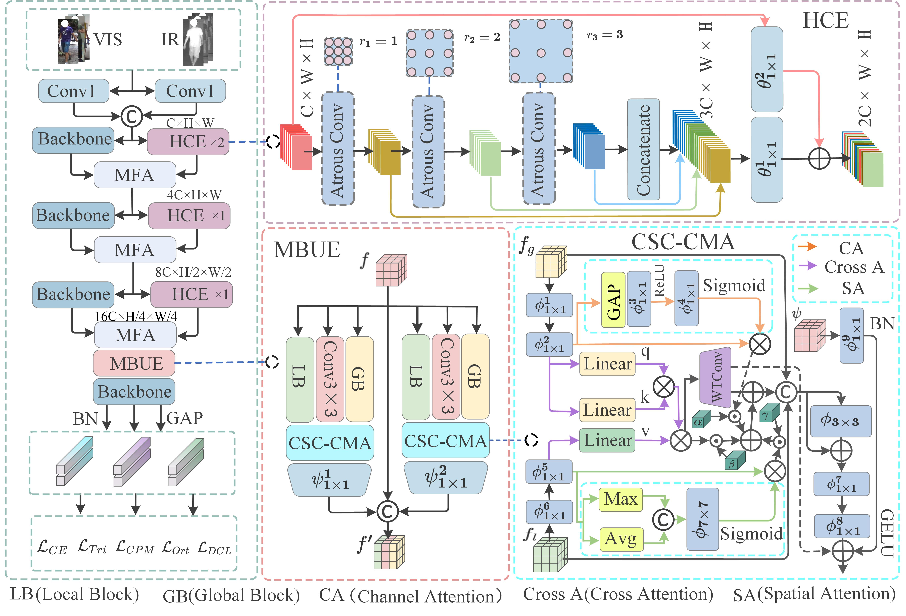

# Context-Awareness and Multi-Branch Attention Fusion for Visible-Infrared Person Re-Identification

A  project for visible-infrared person re-identification, featuring a context-aware multi-branch attention fusion framework – the code implementation and supplement to the related research.
## Contributions
1. We designed a Hierarchical Context Extractor (HCE) that employs dilated convolutions and residual structures to model relationships between human body parts using lightweight parameters. It collaborates with ResNet to extract local details, constructing a comprehensive cross-modal identity representation while effectively mitigating modal discrepancies.
2. We constructed a Multi-Branch Unified Encoder (MBUE) that achieves initial decoupling of modal features via a parallel branch structure. This not only enhances the diversity of feature representations but also effectively addresses the interference of modal discrepancies on feature alignment.
3. We propose the Channel-Spatial-Cross Attention-Guided Cross-Modality Alignment (CSC-CMA) module.It enhances discriminative features and fully separates modal features via channel and spatial attention, then achieves precise cross-modal alignment through cross-attention and adaptive feature interaction.

## Datasets
Put SYSU-MM01, RegDB and LLCM dataset into datasets. Run pre_process_sysu.py to prepare training data for the SYSU-MM01 dataset.

## Environment
conda create -n CMFN python==3.10
conda activate CMFN
pip install torch==1.12.0+cu116 torchvision==0.13.0+cu116 torchaudio==0.12.0 --extra-index-url https://download.pytorch.org/whl/cu116  
scikit-learn, yacs==0.1.8, faiss-gpu, opencv-python, numpy==1.24, pillow==9.5.0, timm, dcn, tensorboardX, triton, pywavelets.
## Training
### SYSU-MM01
python train.py --dataset sysu

### RegDB
sh train_regdb.py

### LLCM
python train,py --dataset llcm
## Evaluation
### SYSU-MM01
python test.py --dataset sysu

### RegDB
python test.py --dataset regdb

### LLCM
python test.py --dataset llcm

## Acknowledgment
Our implementation primarily builds upon the following code repositories. We sincerely appreciate the original authors for their excellent contributions.

[DEEN](https://github.com/ZYK100/LLCM). [DSNet](https://github.com/takaniwa/DSNet). [HiFuse](https://github.com/huoxiangzuo/HiFuse). [WTConv](https://github.com/BGU-CS-VIL/WTConv).
